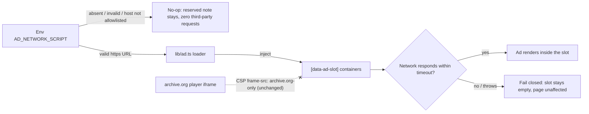

# Decision 001 — Ad network integration (config-gated, fail-closed)

- **Date**: 2026-08-15
- **Council**: Product Council + Feature Council (adapted to this project — no GitHub
  infra exists; the decision record lives here and the task breakdown lands in `tasks.md`)
- **Status**: Approved (scope + plan; build is deferred until the founder runs the build —
  this skill produces a plan, not code)
- **Question**: How should 347movies integrate a real ad network — safely, constitution-
  compliant, and without mock/placeholder code — so the reserved slots can finally render?
- **References**: constitution.md §4 (ads never interrupt the movie), §5 (privacy by
  default), §6 (security-first, CSP), §12 (no mock code); vows.md vow 2 (ads never interrupt
  the movie) and vow 8 (free comes first); specs.md Phase 4; tasks.md T4.1/T4.2;
  FOUNDER-CHECKLIST.md item 4; lib/layout.ts (slot markup), lib/env.ts (config pattern),
  functions/_middleware.ts + public/_headers (CSP)

## Context

347movies is production-ready except for real ad rendering: the sidebar and leaderboard
slots are live, labeled "Advertisement", structurally separated from the player, and
guarded by the smoke suite (6 ad-slot checks). What is missing is a documented, tested
path to render a real network's ads — the one feature-shaped blocker left that does not
require the founder's Cloudflare account access.

The constitutional constraints are the design skeleton, not decoration:

- **§4 / vow 2** — Ads appear only in the sidebar/leaderboard slots; never overlay, pause,
  or precede the player. The player is never wrapped, resized, or covered. Any slot added
  later must be reviewed against this rule before shipping.
- **§5** — No fingerprinting, no hidden trackers. Third-party scripts beyond the chosen ad
  network and affiliate links are forbidden. Analytics must be privacy-respecting and
  disclosed on the privacy page.
- **§6** — Hardened headers must persist: the current CSP is `script-src 'self'` with no
  `unsafe-inline`/`unsafe-eval`, and `frame-src` allows only archive.org. Relaxing the CSP
  is a security-relevant diff.
- **§12** — No mock/pseudo/placeholder code. Nothing renders until a real network is
  configured. (Precedent: T4.2 built the affiliate *mechanism* env-gated with tests and no
  live rendering — the constitution-compatible pattern this plan follows.)

The proven precedent is the affiliate mechanism (`lib/affiliate.ts` + `AMAZON_TAG` env
var): real code, unit-tested, dormant until a real configuration exists. The ad loader
follows the same seam.

## Critical analysis (pre-council challenge)

- **"Ads are the monetization"** — challenged. The real product need is *free forever*
  (vow 1); ads are one model. Donations/Patreon-style support is a possible future
  iteration but does not block ads. **Resolution:** ads proceed; donations noted as future.
- **"Build the loader now?"** — the strongest argument against: the chosen network may use
  a different integration (iframe tags vs. script loaders), making a pre-built loader
  speculative. **Resolution:** the loader is deliberately network-agnostic — every network
  needs "inject an async script into a slot, fail closed." The abstraction is safe; the
  CSP/privacy work is contract-independent regardless.
- **CSP relaxation risk** — the network's exact script host(s) join `script-src` and
  nothing else. `frame-src` stays archive.org-only — this single invariant makes "ads
  never interrupt the movie" structural, not behavioral.
- **Scope-creep guard** — no header bidding, no ad dashboard, no analytics, no
  multi-network support, no self-serve advertising. MVP is: one network, two slot types,
  fail-closed loader, privacy disclosure, smoke guards.

## Council votes

<b>Product Council — 6/6 Approve</b>

| Member | Vote | Key position |
|---|---|---|
| Product Strategist | Approve | Completes the monetization vow honestly. Slots + advertiser contact already live; this makes them earn. Not a launch blocker (site is complete and honest without ads) but the right next feature. |
| Lean Delivery Lead | Approve | Smallest ship = one network + fail-closed loader + privacy disclosure. The config gate IS the feature flag: nothing renders until `AD_NETWORK_SCRIPT` exists. No flag machinery needed. |
| Design Lead (a11y) | Approve | Slots already carry `role="complementary"` + "Advertisement" label. Conditions: reserved slot height (no CLS on ad load), no focus trap, no auto-playing audio, reduced-motion respected. |
| Business Operations | Approve | Cost ≈ zero; revenue gated on traffic. Conditions: written network contract must accept legal-only content, allow brand-safety controls, and the placement policy must be on file before wiring. |
| Principal Engineer | Approve | Seam is clean (`lib/ad.ts` + env config); the CSP allowlist diff is small and reviewable. Hard invariant: `frame-src` stays archive.org-only. |
| Frontend Specialist | Approve | Integration points are known (`[data-ad-slot]` containers in `lib/layout.ts`); the loader is a small, testable module. |

<b>Feature Council — 4/4 Approve</b>

| Member | Vote | Key position |
|---|---|---|
| Principal Engineer | Approve | `lib/ad.ts` exposes one pure decision (`adConfig(env) -> { enabled, scriptUrl } | null`) plus an injector with a hard timeout; host allowlist; fail-closed on any anomaly. No API changes. |
| Frontend Specialist | Approve | Loader targets `[data-ad-slot]` only; slot min-height reserved; existing labels/roles unchanged; player untouched by construction. |
| Backend Specialist | Approve | No endpoints needed. Config is a Cloudflare env var (`AD_NETWORK_SCRIPT`), same pattern as `AMAZON_TAG`. |
| QA Lead | Approve | Unit tests (off → zero DOM/network change; on → inject once; bad URL → fail closed; timeout → fail closed); smoke guards extended; live browser verification once a real network is configured. |

### Post-council synthesis

The councils converged quickly — groupthink check applied. The strongest argument
*against* building any part now: the network contract might never happen, or a chosen
network could require a bespoke loader. That argument shrinks the *loader* to near-zero
risk (it is ~60 lines, network-agnostic, and every network needs it) but it is a real
argument for keeping the **CSP/privacy changes contract-shaped and documented rather than
pre-applied**: we should not relax `script-src` for a network that is not yet chosen.
**Refined recommendation:** build the mechanism + contract now (decision record, loader,
tests, smoke guards, privacy-page section, acceptance checklist); apply the CSP
allowlist only when a specific network is chosen, as part of the same reviewed change
that flips `AD_NETWORK_SCRIPT` on. This matches the affiliate precedent exactly.

## Decision — approved scope

**MVP (build when the founder runs the build step):**
1. `lib/ad.ts` — `adConfig(env)` (validates `AD_NETWORK_SCRIPT`: https-only, host on the
   allowlist constant) and an injector that appends `<script async>` to each
   `[data-ad-slot]` container with a hard timeout. Any anomaly → no-op (slot keeps the
   reserved note; page unaffected). ~60 lines, zero dependencies.
2. Unit tests for the loader (off / on / bad URL / timeout — fail-closed each way).
3. Privacy-page section disclosing the network's data practices — a **hard gate** in the
   same change that enables any network.
4. Acceptance checklist for evaluating a network (legal-only compatible, no player-format
   ads, no auto-playing audio, brand-safety controls, GDPR/CSP-compatible tag).
5. Smoke guards: with no config, zero third-party `<script src>` on any page (proves
   "nothing renders until configured"); slot-integrity guards already exist.

**Deferred (only when a specific network is chosen):**
6. The CSP allowlist diff (exact network script host(s) added to `script-src` only;
   `frame-src` stays archive.org-only) — reviewed against constitution §4 before shipping.
7. `AD_NETWORK_SCRIPT` env var set in Cloudflare; live browser verification (ads render in
   exactly the two slot types, player untouched, Lighthouse a11y 100 + CLS 0 unchanged).
8. Future iterations, explicitly out of MVP: multi-network, header bidding, ad dashboard,
   analytics (privacy-respecting, disclosed), donations.

**Feature flag strategy:** none needed — the config gate *is* the flag (`AD_NETWORK_SCRIPT`
present + allowlisted ⇒ enabled; absent ⇒ dormant).

**Success metrics:** (1) with a real network configured, ads render in exactly the two slot
types and never in/over the player (browser-verified); (2) with the network down or slow,
the page loads identically — fail-closed proven by test; (3) Lighthouse accessibility 100
and CLS 0 on every page type, unchanged after integration.

## Architecture

## Action items (land in tasks.md as T4.3–T4.5)

- [ ] **T4.3 Ad loader mechanism** — `lib/ad.ts` (config + injector, fail-closed) + unit
  tests. Size S (2 days). No deploy alone.
- [ ] **T4.4 Privacy + network contract** — privacy-page disclosure section; documented
  network acceptance checklist (in FOUNDER-CHECKLIST). Size XS (1 day).
- [ ] **T4.5 Verification + enablement** — smoke guards (zero third-party scripts when
  unconfigured); CSP allowlist diff + env var + live browser verification — executed only
  when a real network is chosen. Size S (2 days).

**Estimated complexity:** Small–Medium (~5 business days total, contract-gated at T4.5).

## Follow-up

Revisit when the founder returns with a network contract: run the acceptance checklist,
apply the CSP diff (reviewed against §4), set `AD_NETWORK_SCRIPT`, and execute the live
browser verification. If no contract materializes, the site remains complete and honest —
the loader stays dormant and the smoke guards keep proving it.

> [!NOTE]
> This record was produced under the plan-feature skill adapted to this project: there is
> no GitHub repository, issue tracker, or project board here, so the decision record +
> `tasks.md` breakdown + `changelog.md` entry replace the skill's GitHub artifacts. No
> code was written by this planning pass — building is a separate step.
